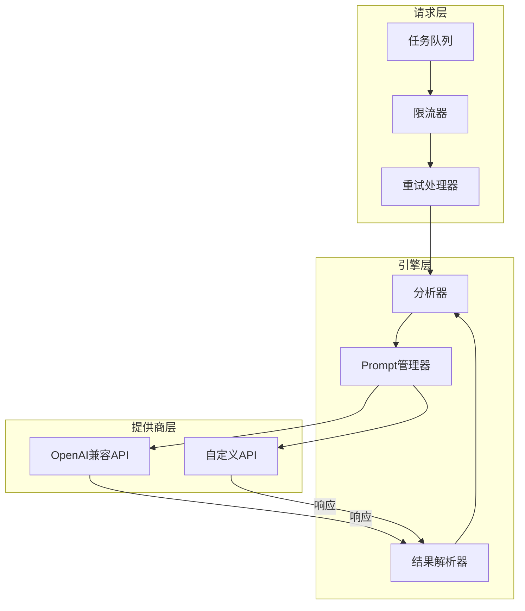

# AI分析引擎架构设计

## 1. 概述

本文档描述 GoResumeReview 的 AI 分析引擎架构设计，支持 OpenAI 兼容 API，实现高并发请求控制和智能简历评估功能。

## 2. 架构概览



## 3. 核心接口定义

### 3.1 分析器接口

```go
// Analyzer AI分析器接口
type Analyzer interface {
    // 分析简历
    Analyze(ctx context.Context, req *AnalysisRequest) (*AnalysisResponse, error)
    
    // 测试连接
    TestConnection(ctx context.Context) error
    
    // 获取支持的模型列表
    GetSupportedModels() []string
}

// AnalysisRequest 分析请求
type AnalysisRequest struct {
    // 简历内容
    ResumeContent string
    
    // 简历文件路径
    ResumePath string
    
    // 岗位需求
    JobRequirements *JobRequirements
    
    // 分析选项
    Options *AnalysisOptions
}

// AnalysisResponse 分析响应
type AnalysisResponse struct {
    // 综合评分 (0-100)
    OverallScore int
    
    // 各维度评分
    Scores *DimensionScores
    
    // 分析摘要
    Summary string
    
    // 优势列表
    Strengths []string
    
    // 劣势列表
    Weaknesses []string
    
    // 推荐意见
    Recommendation string
    
    // 详细分析
    DetailedAnalysis string
    
    // 消耗的Token
    TokensUsed int
    
    // 分析耗时
    Duration time.Duration
}

// DimensionScores 维度评分
type DimensionScores struct {
    // 经验匹配度
    ExperienceMatch int
    
    // 技能匹配度
    SkillMatch int
    
    // 学历匹配度
    EducationMatch int
    
    // 项目匹配度
    ProjectMatch int
    
    // 文化契合度
    CultureMatch int
}

// JobRequirements 岗位需求
type JobRequirements struct {
    // 岗位名称
    Title string
    
    // 关键要求
    Requirements []string
    
    // 必备技能
    RequiredSkills []string
    
    // 加分技能
    PreferredSkills []string
    
    // 学历要求
    EducationLevel string
    
    // 经验要求
    ExperienceYears int
    
    // 工作职责
    Responsibilities []string
    
    // 公司文化关键词
    CultureKeywords []string
}

// AnalysisOptions 分析选项
type AnalysisOptions struct {
    // 是否返回详细分析
    Detailed bool
    
    // 是否返回改进建议
    Suggestions bool
    
    // 分析语言
    Language string
    
    // 评分标准
    ScoringCriteria string
}
```

### 3.2 Prompt 管理器

```go
// PromptManager Prompt模板管理器
type PromptManager struct {
    templates map[string]*PromptTemplate
    mu       sync.RWMutex
}

// PromptTemplate Prompt模板
type PromptTemplate struct {
    Name        string
    Description string
    Template    string
    Variables   []string
    Example     string
}

// DefaultPrompts 默认Prompt模板
var DefaultPrompts = map[string]*PromptTemplate{
    "standard": {
        Name:        "标准分析",
        Description: "通用的简历岗位匹配分析",
        Template: `你是一位资深人力资源专家，请分析以下简历与岗位的匹配程度。

## 岗位需求
{{.JobRequirements}}

## 简历内容
{{.ResumeContent}}

## 分析要求
1. 根据岗位需求评估简历的匹配程度
2. 识别候选人的优势和不足
3. 给出明确的推荐意见

## 输出格式
请以JSON格式输出以下内容：
{
    "overall_score": 85,           // 综合评分 0-100
    "experience_match": 90,         // 经验匹配度 0-100
    "skill_match": 80,              // 技能匹配度 0-100
    "education_match": 85,         // 学历匹配度 0-100
    "summary": "一句话总结",         // 综合评价
    "strengths": ["优势1", "优势2"], // 优势列表
    "weaknesses": ["不足1", "不足2"], // 不足列表
    "recommendation": "强烈推荐面试" // 推荐意见
}

请确保输出是有效的JSON格式，不要包含其他文字。`,
    },
    
    "detailed": {
        Name:        "详细分析",
        Description: "详细的简历分析和改进建议",
        Template: `你是一位资深人力资源专家，请对以下简历进行全面详细的分析。

## 岗位需求
{{.JobRequirements}}

## 简历内容
{{.ResumeContent}}

## 分析要求
请从以下几个维度进行详细分析：
1. 基本信息完整性
2. 工作经历相关性
3. 技能匹配程度
4. 教育背景符合度
5. 项目经验价值
6. 职业发展潜力
7. 文化契合度

## 输出格式
请以JSON格式输出：
{
    "overall_score": 85,
    "detailed_analysis": {
        "basic_info": {"score": 90, "comments": "..."},
        "experience": {"score": 85, "comments": "..."},
        "skills": {"score": 80, "comments": "..."},
        "education": {"score": 85, "comments": "..."}
    },
    "strengths": ["...", "..."],
    "weaknesses": ["...", "..."],
    "suggestions": ["改进建议1", "改进建议2"],
    "interview_questions": ["面试问题1", "面试问题2"],
    "recommendation": "推荐面试",
    "reasoning": "详细的推荐理由"
}

请确保输出是有效的JSON格式。`,
    },
    
    "quick": {
        Name:        "快速分析",
        Description: "快速筛选型分析",
        Template: `快速评估以下简历与岗位的匹配度，只需给出评分和建议。

## 岗位：{{.JobTitle}}
## 要求：{{.Requirements}}

## 简历：{{.ResumeContent}}

## 输出JSON：
{"score": 0-100, "recommendation": "通过/不通过/待定", "key_reason": "核心原因"}`,
    },
}
```

## 4. OpenAI 兼容 API 实现

### 4.1 客户端配置

```go
// OpenAIClient OpenAI兼容API客户端
type OpenAIClient struct {
    // API地址
    BaseURL string
    
    // API密钥
    APIKey string
    
    // 模型名称
    Model string
	
    // HTTP客户端
    httpClient *http.Client
	
    // 请求超时
    Timeout time.Duration
}

// NewOpenAIClient 创建客户端
func NewOpenAICompatibleClient(config *Config) (*OpenAIClient, error) {
    return &OpenAIClient{
        BaseURL:   config.BaseURL,
        APIKey:    config.APIKey,
        Model:     config.Model,
        Timeout:   60 * time.Second,
    }, nil
}
```

### 4.2 API 调用实现

```go
// ChatRequest 聊天请求
type ChatRequest struct {
    Model    string          `json:"model"`
    Messages []ChatMessage   `json:"messages"`
    MaxTokens int           `json:"max_tokens,omitempty"`
    Temperature float64     `json:"temperature,omitempty"`
}

// ChatMessage 聊天消息
type ChatMessage struct {
    Role    string `json:"role"`
    Content string `json:"content"`
}

// ChatResponse 聊天响应
type ChatResponse struct {
    ID      string   `json:"id"`
    Object  string   `json:"object"`
    Created int64    `json:"created"`
    Model   string   `json:"model"`
    Choices []Choice `json:"choices"`
    Usage   Usage    `json:"usage"`
}

// Choice 选择
type Choice struct {
    Index        int     `json:"index"`
    Message      Message  `json:"message"`
    FinishReason string  `json:"finish_reason"`
}

// Message 消息
type Message struct {
    Role    string `json:"role"`
    Content string `json:"content"`
}

// Usage 使用量
type Usage struct {
    PromptTokens     int `json:"prompt_tokens"`
    CompletionTokens int `json:"completion_tokens"`
    TotalTokens      int `json:"total_tokens"`
}

// Chat 实现Chat接口
func (c *OpenAIClient) Chat(ctx context.Context, req *ChatRequest) (*ChatResponse, error) {
    // 构建请求体
    body := ChatRequest{
        Model:    c.Model,
        Messages: req.Messages,
        MaxTokens: 2000,
        Temperature: 0.3, // 低温度，确保结果稳定
    }
    
    // 发送请求
    resp, err := c.doRequest(ctx, "POST", "/chat/completions", body)
    if err != nil {
        return nil, err
    }
    
    // 解析响应
    var chatResp ChatResponse
    if err := json.Unmarshal(resp, &chatResp); err != nil {
        return nil, err
    }
    
    return &chatResp, nil
}
```

## 5. 并发控制

### 5.1 限流器

```go
// RateLimiter 限流器
type RateLimiter struct {
    // 每秒请求数
    requestsPerSecond float64
    
    // 每次请求Token限制
    tokensPerRequest int
    
    // 总Token限制（窗口期）
    totalTokensWindow int
	
    // 滑动窗口
    window *SlidingWindow
}

// Acquire 获取许可
func (r *RateLimiter) Acquire(ctx context.Context, estimatedTokens int) error

// Wait 等待直到可以发送请求
func (r *RateLimiter) Wait(ctx context.Context, estimatedTokens int) error
```

### 5.2 重试机制

```go
// RetryConfig 重试配置
type RetryConfig struct {
    // 最大重试次数
    MaxRetries int
    
    // 重试间隔
    BaseDelay time.Duration
    
    // 最大重试间隔
    MaxDelay time.Duration
    
    // 重试因子
    BackoffFactor float64
    
    // 可重试错误码
    RetryableStatusCodes []int
}

// RetryHandler 重试处理器
type RetryHandler struct {
    config *RetryConfig
    client *OpenAIClient
}

// DoWithRetry 带重试执行
func (h *RetryHandler) DoWithRetry(ctx context.Context, req *ChatRequest) (*ChatResponse, error) {
    var lastErr error
    
    for attempt := 0; attempt <= h.config.MaxRetries; attempt++ {
        resp, err := h.client.Chat(ctx, req)
        
        if err == nil {
            return resp, nil
        }
        
        lastErr = err
        
        // 检查是否可重试
        if !h.isRetryable(err) {
            break
        }
        
        // 计算延迟
        delay := h.calculateDelay(attempt)
        
        select {
        case <-ctx.Done():
            return nil, ctx.Err()
        case <-time.After(delay):
            // 继续重试
        }
    }
    
    return nil, lastErr
}
```

## 6. Worker Pool 并发处理

```go
// AnalyzerPool 分析器Worker池
type AnalyzerPool struct {
    // 工作协程数量
    workers int
	
    // 任务队列
    taskQueue chan *AnalysisTask
	
    // 结果队列
    resultQueue chan *AnalysisResult
	
    // 客户端池
    clients []*OpenAIClient
	
    // 限流器
    rateLimiter *RateLimiter
	
    // 上下文
    ctx context.Context
	
    // 取消函数
    cancel context.CancelFunc
}

// AnalysisTask 分析任务
type AnalysisTask struct {
    ID        string
    Resume    *Resume
    Request   *AnalysisRequest
    ResultCh  chan *AnalysisResult
}

// AnalysisResult 分析结果
type AnalysisResult struct {
    TaskID   string
    Response *AnalysisResponse
    Error    error
}

// NewAnalyzerPool 创建分析器池
func NewAnalyzerPool(config *PoolConfig) (*AnalyzerPool, error) {
    // 创建多个API客户端实现负载均衡
    clients := make([]*OpenAIClient, config.ClientCount)
    for i := 0; i < config.ClientCount; i++ {
        clients[i] = NewOpenAIClient(&config.APIConfig)
    }
    
    return &AnalyzerPool{
        workers:      config.WorkerCount,
        taskQueue:    make(chan *AnalysisTask, config.QueueSize),
        resultQueue:  make(chan *AnalysisResult, config.QueueSize),
        clients:      clients,
        rateLimiter:  NewRateLimiter(config.RPM, config.TPM),
    }, nil
}

// Start 启动Worker池
func (p *AnalyzerPool) Start(ctx context.Context) {
    ctx, cancel := context.WithCancel(ctx)
    p.ctx = ctx
    p.cancel = cancel
    
    // 启动Worker
    for i := 0; i < p.workers; i++ {
        go p.worker(ctx, i)
    }
    
    // 启动结果收集器
    go p.collectResults(ctx)
}

// worker Worker协程
func (p *AnalyzerPool) worker(ctx context.Context, id int) {
    client := p.clients[id%len(p.clients)]
    
    for {
        select {
        case <-ctx.Done():
            return
        case task := <-p.taskQueue:
            p.processTask(ctx, client, task)
        }
    }
}

// processTask 处理单个任务
func (p *AnalyzerPool) processTask(ctx context.Context, client *OpenAIClient, task *AnalysisTask) {
    // 等待限流器许可
    if err := p.rateLimiter.Wait(ctx, task.EstimatedTokens()); err != nil {
        task.ResultCh <- &AnalysisResult{
            TaskID: task.ID,
            Error:   err,
        }
        return
    }
    
    // 执行分析
    resp, err := client.Analyze(ctx, task.Request)
    
    // 发送结果
    task.ResultCh <- &AnalysisResult{
        TaskID:   task.ID,
        Response: resp,
        Error:    err,
    }
}

// Submit 提交任务
func (p *AnalyzerPool) Submit(task *AnalysisTask) {
    p.taskQueue <- task
}

// Stop 停止Worker池
func (p *AnalyzerPool) Stop() {
    if p.cancel != nil {
        p.cancel()
    }
}
```

## 7. 结果解析

```go
// ResponseParser 响应解析器
type ResponseParser struct{}

// ParseAnalysisResponse 解析分析响应
func (p *ResponseParser) ParseAnalysisResponse(raw string) (*AnalysisResponse, error) {
    // 清理响应（移除markdown代码块标记等）
    cleaned := p.cleanResponse(raw)
    
    // 解析JSON
    var data map[string]interface{}
    if err := json.Unmarshal([]byte(cleaned), &data); err != nil {
        // 尝试从markdown代码块中提取JSON
        cleaned = p.extractJSONFromMarkdown(cleaned)
        if err := json.Unmarshal([]byte(cleaned), &data); err != nil {
            return nil, fmt.Errorf("failed to parse response: %w", err)
        }
    }
    
    // 转换为结构化对象
    return p.convertToAnalysisResponse(data)
}

// cleanResponse 清理响应
func (p *ResponseParser) cleanResponse(raw string) string {
    // 移除 ```json 和 ```
    re := regexp.MustCompile("```(?:json)?\\s*([\\s\\S]*?)\\s*```")
    matches := re.FindStringSubmatch(raw)
    if len(matches) > 1 {
        return matches[1]
    }
    return raw
}
```

## 8. API配置管理

```go
// APIConfig API配置
type APIConfig struct {
    // 提供商类型
    Provider string `json:"provider" validate:"required"`
    
    // API地址
    BaseURL string `json:"base_url" validate:"required,url"`
    
    // API密钥
    APIKey string `json:"api_key" validate:"required"`
    
    // 模型名称
    Model string `json:"model" validate:"required"`
    
    // 并发请求数
    ConcurrentRequests int `json:"concurrent_requests" validate:"min=1,max=10"`
    
    // 重试次数
    MaxRetries int `json:"max_retries" validate:"min=0,max=5"`
    
    // 请求超时(秒)
    Timeout int `json:"timeout" validate:"min=10,max=300"`
}

// SupportedProviders 支持的提供商
var SupportedProviders = []ProviderInfo{
    {
        ID:       "openai",
        Name:     "OpenAI",
        BaseURL:  "https://api.openai.com/v1",
        Models:   []string{"gpt-4o", "gpt-4o-mini", "gpt-4-turbo"},
    },
    {
        ID:       "azure",
        Name:     "Azure OpenAI",
        BaseURL:  "",
        Models:   []string{"gpt-4o", "gpt-4-turbo"},
    },
    {
        ID:       "anthropic",
        Name:     "Anthropic Claude",
        BaseURL:  "https://api.anthropic.com/v1",
        Models:   []string{"claude-3-5-sonnet", "claude-3-haiku"},
    },
    {
        ID:       "zhipu",
        Name:     "智谱AI",
        BaseURL:  "https://open.bigmodel.cn/api/paas/v4",
        Models:   []string{"glm-4", "glm-4v", "glm-3-turbo"},
    },
    {
        ID:       "deepseek",
        Name:     "DeepSeek",
        BaseURL:  "https://api.deepseek.com",
        Models:   []string{"deepseek-chat"},
    },
    {
        ID:       "custom",
        Name:     "自定义API",
        BaseURL:  "",
        Models:   []string{},
    },
}
```

## 9. 错误处理

```go
// AnalyzerError 分析器错误
type AnalyzerError struct {
    Code    ErrorCode
    Message string
    Retryable bool
    Err     error
}

type ErrorCode int

const (
    ErrCodeUnknown ErrorCode = iota
    ErrCodeAPIError
    ErrCodeRateLimited
    ErrCodeInvalidResponse
    ErrCodeContextCancelled
    ErrCodeTimeout
)

// IsRetryable 判断是否可重试
func (e *AnalyzerError) IsRetryable() bool {
    return e.Retryable
}
```

## 10. 性能监控

```go
// Metrics 性能指标
type Metrics struct {
    // 总请求数
    TotalRequests int64
    
    // 成功请求数
    SuccessfulRequests int64
    
    // 失败请求数
    FailedRequests int64
    
    // 平均响应时间
    AverageResponseTime time.Duration
    
    // Token消耗
    TokensConsumed int64
    
    // 队列等待时间
    QueueWaitTime time.Duration
}

// GetMetrics 获取性能指标
func (p *AnalyzerPool) GetMetrics() *Metrics
```

## 11. 测试用例

```go
func TestAnalyzer_Analyze(t *testing.T) {
    // 准备测试数据
    resume := &Resume{
        Content: "张三\n工作5年\nGo开发工程师\n...",
    }
    
    jobReq := &JobRequirements{
        Title:           "高级Go开发工程师",
        RequiredSkills:  []string{"Go", "MySQL", "Redis"},
        ExperienceYears: 3,
    }
    
    // 创建分析器
    analyzer := NewOpenAIClient(&APIConfig{
        BaseURL: "https://api.openai.com/v1",
        APIKey:  "test-key",
        Model:   "gpt-4o",
    })
    
    // 执行分析
    resp, err := analyzer.Analyze(context.Background(), &AnalysisRequest{
        Resume:         resume,
        JobRequirements: jobReq,
    })
    
    // 验证结果
    assert.NoError(t, err)
    assert.NotNil(t, resp)
    assert.GreaterOrEqual(t, resp.OverallScore, 0)
    assert.LessOrEqual(t, resp.OverallScore, 100)
}
```
