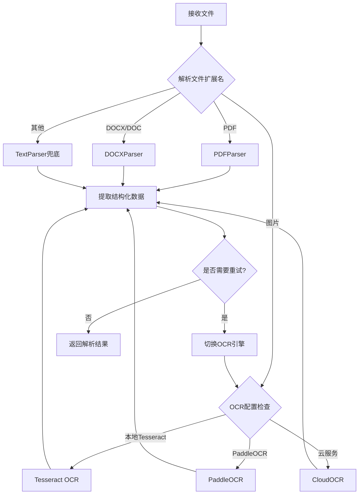

# 文档解析器架构设计

## 1. 概述

本文档描述 GoResumeReview 的文档解析模块架构设计，采用插件化架构实现格式扩展的便利性和高识别准确率。

## 2. 架构设计

### 2.1 核心接口定义

```go
// Parser 文档解析器接口
type Parser interface {
    // 获取解析器支持的格式
    SupportedFormats() []string
    
    // 解析文档
    Parse(ctx context.Context, filePath string) (*ParseResult, error)
    
    // 优先级（数值越小优先级越高）
    Priority() int
    
    // 解析器名称
    Name() string
}
```

### 2.2 解析结果结构

```go
// ParseResult 解析结果
type ParseResult struct {
    // 原始文本内容
    Content string
    
    // 结构化数据
    StructuredData *ResumeData
    
    // 元数据
    Metadata *DocumentMetadata
    
    // 解析耗时
    Duration time.Duration
    
    // 错误信息
    Error error
}

// ResumeData 简历结构化数据
type ResumeData struct {
    // 姓名
    Name string `json:"name"`
    
    // 联系方式
    Contact *ContactInfo `json:"contact"`
    
    // 教育经历
    Education []*Education `json:"education"`
    
    // 工作经历
    Experience []*Experience `json:"experience"`
    
    // 技能清单
    Skills []string `json:"skills"`
    
    // 项目经历
    Projects []*Project `json:"projects"`
    
    // 证书资质
    Certifications []string `json:"certifications"`
    
    // 自我介绍/概述
    Summary string `json:"summary"`
}

// DocumentMetadata 文档元数据
type DocumentMetadata struct {
    // 文件路径
    FilePath string
    
    // 文件名
    FileName string
    
    // 文件大小
    FileSize int64
    
    // 文件类型
    FileType string
    
    // 页数（PDF）
    PageCount int
    
    // 创建者信息（如果有）
    Creator string
    
    // 创建时间
    CreatedAt time.Time
    
    // 修改时间
    ModifiedAt time.Time
}
```

### 2.3 注册中心

```go
// ParserRegistry 解析器注册中心
type ParserRegistry struct {
    mu       sync.RWMutex
    parsers  map[string]Parser
    formats  map[string][]string // format -> parsers
}

// Register 注册解析器
func (r *ParserRegistry) Register(parser Parser) error

// GetParser 获取解析器
func (r *ParserRegistry) GetParser(filePath string) (Parser, error)

// GetParserByFormat 根据格式获取解析器
func (r *ParserRegistry) GetParserByFormat(format string) (Parser, error)

// ListParsers 列出所有解析器
func (r *ParserRegistry) ListParsers() []Parser
```

## 3. 内置解析器实现

### 3.1 PDF 解析器

```go
// PDFParser PDF文档解析器
type PDFParser struct {
    config *PDFConfig
}

// NewPDFParser 创建PDF解析器
func NewPDFParser(config *PDFConfig) *PDFParser {
    return &PDFParser{config: config}
}

// SupportedFormats 支持的格式
func (p *PDFParser) SupportedFormats() []string {
    return []string{".pdf"}
}

// Parse 解析PDF
func (p *PDFParser) Parse(ctx context.Context, filePath string) (*ParseResult, error) {
    // 使用 pdfcpu 解析PDF文本
    // 提取元数据：页数、作者等
    // 尝试识别简历结构
}

// 优先级：1（最高）
func (p *PDFParser) Priority() int {
    return 1
}
```

### 3.2 Word 解析器

```go
// DOCXParser Word文档解析器
type DOCXParser struct {
    config *DOCXConfig
}

// NewDOCXParser 创建DOCX解析器
func NewDOCXParser(config *DOCXConfig) *DOCXParser {
    return &DOCXParser{config: config}
}

// SupportedFormats 支持的格式
func (p *DOCXParser) SupportedFormats() []string {
    return []string{".docx", ".doc"}
}

// Parse 解析Word文档
func (p *DOCXParser) Parse(ctx context.Context, filePath string) (*ParseResult, error) {
    // 使用 docxgo 解析Word文档
    // 提取文本和格式信息
}

// 优先级：2
func (p *DOCXParser) Priority() int {
    return 2
}
```

### 3.3 图片 OCR 解析器

```go
// OCRParser 图片OCR解析器
type OCRParser struct {
    config *OCRConfig
    engine string // "tesseract" | "paddle"
}

// NewOCRParser 创建OCR解析器
func NewOCRParser(config *OCRConfig) *OCRParser {
    return &OCRParser{config: config}
}

// SupportedFormats 支持的格式
func (p *OCRParser) SupportedFormats() []string {
    return []string{".jpg", ".jpeg", ".png", ".bmp", ".gif", ".tiff"}
}

// Parse 解析图片
func (p *OCRParser) Parse(ctx context.Context, filePath string) (*ParseResult, error) {
    // 使用 Tesseract 或 PaddleOCR 进行文字识别
    // 支持中文和英文
}

// 优先级：3
func (p *OCRParser) Priority() int {
    return 3
}
```

### 3.4 纯文本解析器

```go
// TextParser 纯文本解析器
type TextParser struct{}

// NewTextParser 创建文本解析器
func NewTextParser() *TextParser {
    return &TextParser{}
}

// SupportedFormats 支持的格式
func (p *TextParser) SupportedFormats() []string {
    return []string{".txt", ".md"}
}

// Parse 解析纯文本
func (p *TextParser) Parse(ctx context.Context, filePath string) (*ParseResult, error) {
    // 直接读取文本内容
    // 简单解析简历结构
}

// 优先级：10（最低，作为兜底）
func (p *TextParser) Priority() int {
    return 10
}
```

## 4. 扩展开发指南

### 4.1 添加新的文档格式支持

#### 步骤 1: 实现 Parser 接口

```go
package myparser

import (
    "context"
    "fmt"
    
    "github.com/goresumereview/internal/parser"
)

type MyParser struct{}

func (m *MyParser) Name() string {
    return "My Custom Parser"
}

func (m *MyParser) SupportedFormats() []string {
    return []string{".myformat"}
}

func (m *MyParser) Priority() int {
    return 5 // 根据准确性设置优先级
}

func (m *MyParser) Parse(ctx context.Context, filePath string) (*parser.ParseResult, error) {
    // 实现解析逻辑
    return &parser.ParseResult{}, nil
}
```

#### 步骤 2: 注册解析器

```go
// 在 parser.go 的 init() 函数中注册
func init() {
    parser.Register(&myparser.MyParser{})
}
```

### 4.2 OCR 引擎切换

支持切换不同的 OCR 引擎以提高识别准确率：

```go
// OCRConfig OCR配置
type OCRConfig struct {
    // 引擎选择：tesseract | paddle | cloud
    Engine string `json:"engine"`
    
    // 语言设置
    Languages []string `json:"languages"`
    
    // DPI设置
    DPI int `json:"dpi"`
    
    // 是否预处理图片
    Preprocess bool `json:"preprocess"`
}
```

### 4.3 云服务 OCR 集成

```go
// CloudOCRParser 云服务OCR解析器
type CloudOCRParser struct {
    config *CloudOCRConfig
}

// 支持的云服务
type CloudOCRConfig struct {
    // 服务商：google | azure | aws | baidu
    Provider string `json:"provider"`
    
    // API密钥
    APIKey string `json:"apiKey"`
    
    // API端点
    Endpoint string `json:"endpoint"`
    
    // 超时时间
    Timeout time.Duration `json:"timeout"`
}
```

## 5. 性能优化

### 5.1 解析缓存

```go
// ParseCache 解析结果缓存
type ParseCache struct {
    cache *ristretto.Cache
    ttl   time.Duration
}

// Get 获取缓存
func (c *ParseCache) Get(fileHash string) (*ParseResult, bool)

// Set 设置缓存
func (c *ParseCache) Set(fileHash string, result *ParseResult)
```

### 5.2 并发限制

```go
// ConcurrencyLimiter 并发限制器
type ConcurrencyLimiter struct {
    semaphore chan struct{}
}

// Acquire 获取许可
func (l *ConcurrencyLimiter) Acquire(ctx context.Context) error

// Release 释放许可
func (l *ConcurrencyLimiter) Release()
```

## 6. 格式识别流程



## 7. 准确率提升策略

### 7.1 多引擎融合

```go
// FusionParser 多引擎融合解析器
type FusionParser struct {
    parsers []Parser
    weights []float64 // 权重
}

// Parse 融合解析
func (f *FusionParser) Parse(ctx context.Context, filePath string) (*ParseResult, error) {
    // 并行调用多个解析器
    // 根据权重融合结果
    // 返回最佳结果
}
```

### 7.2 简历结构智能识别

```go
// ResumeStructureDetector 简历结构检测器
type ResumeStructureDetector struct {
    model * NLPModel
}

// Detect 检测简历结构
func (d *ResumeStructureDetector) Detect(content string) (*ResumeData, error) {
    // 使用NLP模型识别简历各部分
    // 姓名、联系方式、教育经历、工作经历等
}
```

## 8. 测试规范

### 8.1 单元测试

```go
func TestPDFParser_Parse(t *testing.T) {
    parser := NewPDFParser(&PDFConfig{})
    
    result, err := parser.Parse(context.Background(), "testdata/resume.pdf")
    
    assert.NoError(t, err)
    assert.NotEmpty(t, result.Content)
    assert.Contains(t, result.Content, "工作经验")
}
```

### 8.2 准确率测试

```go
func TestParserAccuracy(t *testing.T) {
    testCases := []TestCase{
        {
            Name:     "标准简历PDF",
            File:     "testdata/standard.pdf",
            Expected: 0.95, // 期望准确率 95%
        },
    }
    
    for _, tc := range testCases {
        t.Run(tc.Name, func(t *testing.T) {
            accuracy := CalculateAccuracy(tc.File)
            assert.GreaterOrEqual(t, accuracy, tc.Expected)
        })
    }
}
```
